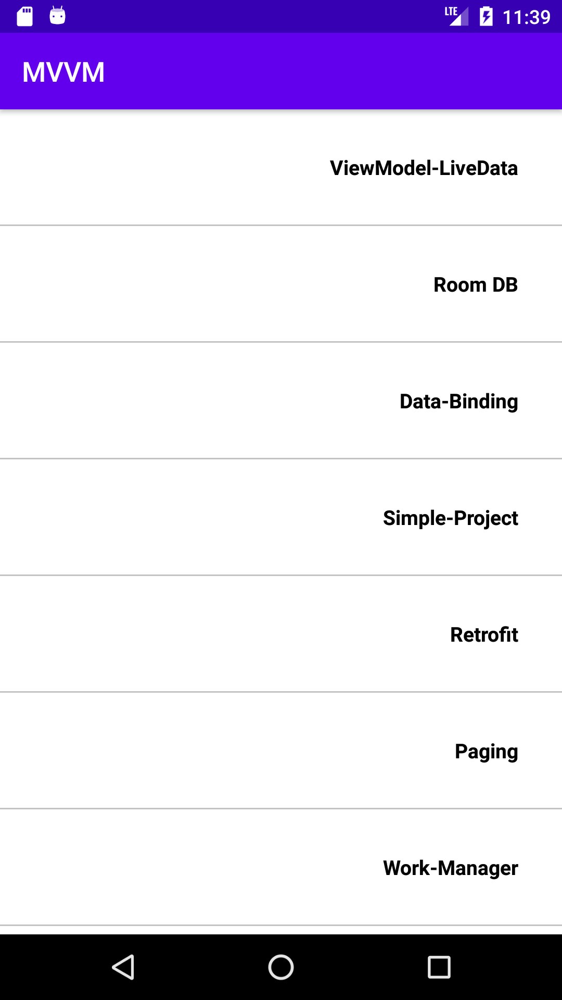

## android-mvvm-simple-practice

# developed by Mahdi Razzaghi Ghaleh
mvvm simple practice by JAVA android

# Android Jetpack
Android Jetpack is a set of components, tools and guidance provided by google for Android Developers to make great android apps in a very efficient and effective manner.

If you use architecture components you will have a fewer amount of boilerplate code.your codes will be cleaner and very readable.

# Data Binding:
This library allows us to bind UI components in our layouts to data sources of the app using a declarative format.This allows UI values to update automatically without manual intervention.
What are the benefits?
Not to use findViewById()
Not to create many Adapters
To handle Call Backs easily
Data binding for forms
Set fonts directly to XML
# Lifecycle Aware Components:
We can create separate classes with lifecycle aware components we can create separate classes to observe the changes of lifecycle state and act accordingly.
This helps us to create better-organized, and lighter-weight code, that is easier to maintain.

# View Model:
In simple terms view model is the model class for a view. A class which keeps data for a view.
If it is required, you can create separate view models for each activity or fragment in your application.
This class is designed to store and manage UI-related data in a lifecycle conscious way.
The ViewModel class allows data to survive configuration changes such as screen rotations, keyboard changes, language changes and enabling multi window mode.
LiveData, LiveData is an observable data holder class. We can use live data to get real time updates for the user interfaces.LiveData only updates app component observers that are in an active lifecycle state.
LiveData does not replace rxJava but it allows us to perform some tasks done by RxJava in a much easier manner.
# Room:
Room data persistence library is a great alternative to SQLite openHelper which have been used by Android developers for many years to work with SQLite databases.
Room acts as wrapper around SQLite database. Room reduces a lot of boilerplate codes and makes your code base cleaner and much readable.
Room is a Database layer on top of SQLite database.
Room takes care of tasks that we used to handle with the SQLiteOpenHelper.
Room acts as an access point to the underlying SQLite Database.
Room uses Data Access Objects(DAO) to issue queries to the SQLite database.
When we are working with room, we need to work with three main types of components:
Database: To represent the database, we need to create an abstract database class which extends RoomDatabase.
Entity Classes: To represent each database table we should create entity classes
DAOs: We also need to create data access object interfaces to communicate with the database.
Room Database use Annotation to control database,Room Database has a least 20 Annotation.
@Database: Database Annotation marks a class as a room database.And this class should also extend roomDatabase.
@Entity: Entity Annotation marks a class as an entity or a model.We create entities to represent each of the database tables.If you have 5 tables in your database,you may create 5 entity classes.
@PrimaryKey: Marks a field in an entity as the primary key.
@ForeignKey: Declares a foreign key on another entity.
@ColumnInfo: Allows specific customization about the column associated with the field.
@DAO: Marks the interface as a data access object(DAO).
@Insert: Marks a method as an Insert method.
@Query: Marks a method as a Query method.
@Update: Marks a method as an Update method.
@Delete: Marks a method as a delete method.

# Navigation:
This components allow you to design the interactions that allow users to move across, into, and back our from the different content areas within your app.
# Work Manager:
There are a lot of Background processing tasks in an android application like Send Logs, upload data and Sync data with the server.
You can create a background task and hand it off to WorkManager to run immediately or at an appropriate time.
WorkManager choose the best way to run your task based on different factors such as the device API level and the app state.
# Paging:
This library makes it easier to load data to a recyclerView, step by step in your app using live data.
This supports both large bounded list and unbounded lists, such as continuously updating feeds.
Paging Library helps you to observe and display a reasonable subset of your data at a time, rather than loading all the data at once.
Advantages:
App consumes less network bandwidth and fewer system resources.
App works efficiently, data loading time has minimized.
During updates and refreshes app behaves normal and respond quickly.
Paging library is easier to code.

There are 3 main classes to consider when you are working with paging library:PagedListAdapter, PagedList and DataSource.
PagedListAdapter class extends the RecyclerViewAdapter class so we should replace it in the adapter.
PagedList is for loading the data automatically, this allows you to configure the initial load size, the page size, and also the pre fetch distance.
DataSource is an interface to provide the data step by step,it is the base class comes with paging library for data loading,
Paging Library also hsa 3 implementations of the base DataSource class:
PageKeyedDataSource:if we are going to pass page number as a query parameter in the request we can use PageKeyedDataSource.
ItemKeyedDataSource:if we are going to fetch data using a key belong to an item. as an example, in our project if we are going the fetch data using the id of movies we can use ItemKeyedDataSource.
PositionalDataSource:if we have a data source with a known fixed size, and we are going to fetch items with arbitrary positions we can use PositionalDataSource.

